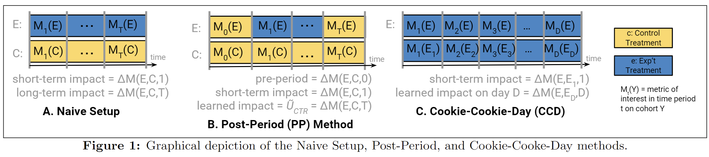
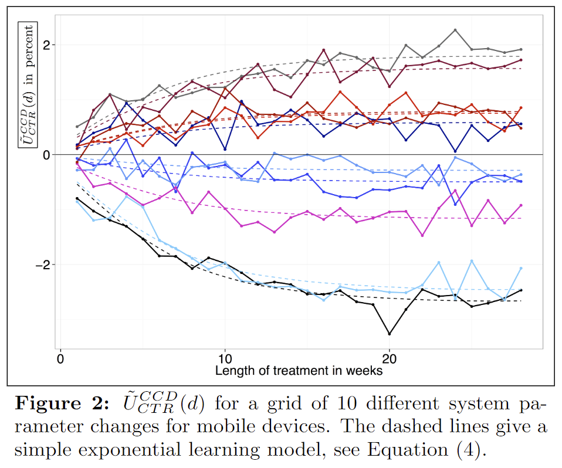
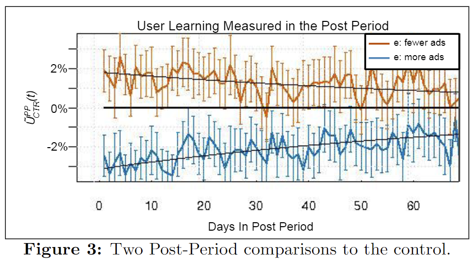
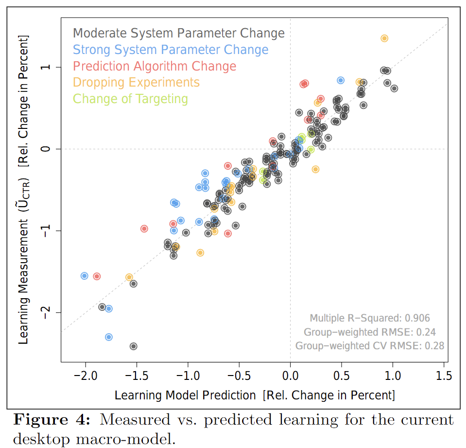
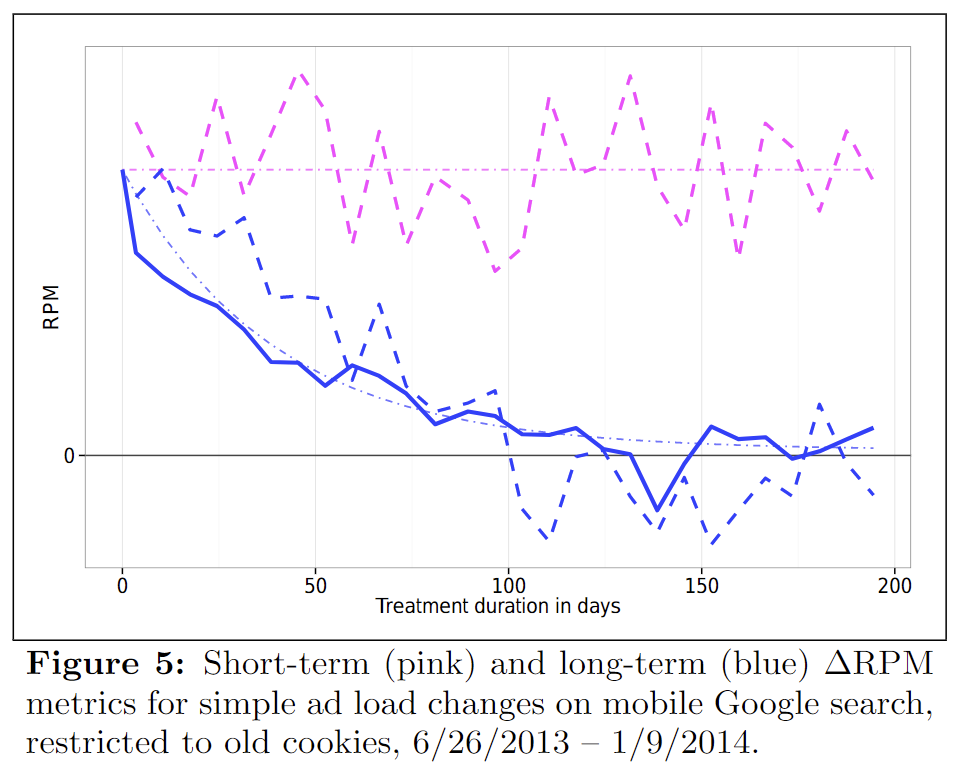
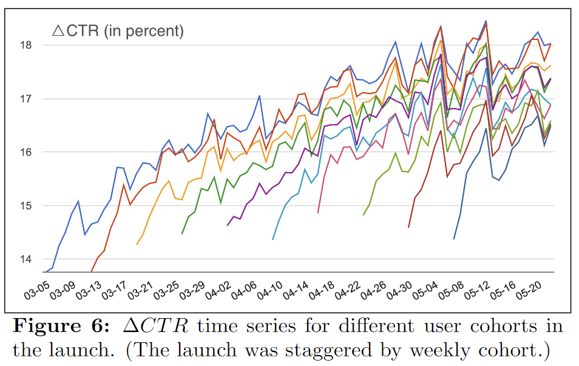

# Focusing on the Long-term: It’s Good for Users and Business

## Abstract

A/B テスト期間における指標の変化という短期的な効果ではなく、その変更がユーザにもたらす長期的な変化をどう測定し予測するかを、Google 検索広告を例に説明した論文。
本論文の手法は、広告に限らない一般のサービスにおけるユーザの長期的変化の評価に適用可能であり、検索広告では広告の掲載を減らすことは長期で売上が向上する可能性が高いことが示された。

## 1. Introduction

数日や数週間といった短期の最適化だけでなく、年単位のような長期の改善 (潜在的な変化) も反映できるように overall evaluation criterion (OED) を構築したい。(例えば、広告を貼る/あまり関係のないモジュールを出す等、短期・長期のトレードオフがありそうな施策はよくあるが、その選択がどの程度良いものなのか誰もわかってない)
しかし、そのような指標は、

- 測定に時間がかかりすぎる
- 多くの短期施策が行われる中で長期的な影響のみを評価するのが難しい
- 十分な検出力を得られるかわからない (例えば広告だと 0.1% の変化でも重要である)

といった問題があるため、その必要性に反して実例が少ない。

そこで、この論文では Google の検索広告を用いて**ユーザの本質的な広告の click 傾向の変化を測定する**方法を説明し、**短期のテスト結果から長期の影響を予測するモデルの構築**を行う。
具体的には、広告の quality と 広告のロード時間 (user experience) を用いて*ads blindness* and *ads sightedness* を定量化し、それをシンプルなモデルで近似する。

なお、Google の検索広告では本論文で得られた結果を用いて

- changed the auction ranking function
- reduced the ad load on the mobile interface

といった意思決定が実際に行われた。

## 2. Background & Related Work

これまで、Google や Google 検索広告では常に *ads quality* を優先してきており (短期的指標を追い求めてしまうと長期的にはユーザが広告を無視するようになったり果てには Google を使うのをやめてしまう可能性が高いため)、bid と *algorithmically-determined* quality signals の組み合わせで auction ranking を行っている。(その結果、ほとんどの query で広告を掲載していない)

#### Experimental unit

本論文では、ランダム化単位をユーザとし、ユーザ識別子として cookie を用いる。
また、各ランダム化実験単位を cohort と呼び、experiment cohort を $E$、control cohort を $C$ と表記する。

ある metrics $M$ を experiment cohort と control cohort で比較する際は常に相対変化で表すこととする。つまり、測定する量は

$$
\Delta M = \Delta M(E, C) \equiv \frac{M(E) - M(C)}{M(C)}.
$$

また、特定の時刻 $t$ での変化を explicit に $\Delta M(E, C, t)$ と表すことにする。
なお、metrics $M$ は常に cohort 単位で集計して計算されたものである (ユーザ単位ではない)。

#### User learning

>*Thorndike’s  Law of Effect*  
>positive outcomes reinforce the behavior that caused them and negative outcomes diminish the behavior that caused them.

Thorndike’s  Law of Effect に基づけば、ユーザはその変更がもたらす結果を学習し行動を変容させていく。
そこで本論文が扱う検索広告では、ユーザが本質的にどの程度広告を click するかを表す **ads blindnes and sightedness** を定量化する。
これは、言い換えれば A/B テスト期間に測られる **short-term impact** ではなくそれの $t \rightarrow \infty$ での極限である **long-term impact** について考えるということである。

#### Long-term revenue

広告売上は以下のように分解される。

$$
Revenue = Users \cdot \frac{Tasks}{User} \cdot \frac{Queries}{Task} \cdot \frac{Ads}{Query} \cdot \frac{Clicks}{Ad} \cdot \frac{Cost}{Click}.
$$

例えば、広告の掲載数を増やして広告のロード時間を長くすると、

- $Ads/Query$ (term 4) は上昇
- user learning effect により terms 1, 2, 5 は長期的に減少
    - アルゴリズムは常に最も良い広告を掲載しているはずなので、掲載数の増加は $CTR = Clicks/Ad$ (term 5) を低下させる

となることが想像される。従って、短期的には売上は向上するが長期的には売上を減少させる可能性が高い。

Google 検索広告の実験では、user learning による term 1, 2 への統計的有意な影響が見られなかったため、ここでは $CTR = Clicks/Ad$ を考え、 user learning による $CTR$ の相対変化 $U_{CTR}$ を測定することを目的とする。

## 3. Measuring User Learning

まずは ads blindness and sightedness を測定する方法を紹介する。
ただし、ここで紹介する方法はいずれも本質的な user learning の効果を過小評価しているため、$U_{CTR}$ の近似として $\tilde{U}_{CTR}$ を用いる。(その理由は Sec. 3.3 で)

### 3.1 Experiment Design & Methodology

### 3.1.1 Naive Setup

シンプルな setup は (いつも通り) cookie 群を $E$ と $C$ に分けてそれぞれ user learning が起きるくらい十分長い時間 $t=T$ まで介入を行うこと。
ただし、現実的にはシステム変更や季節性、種々のその他の変更などによって残念ながらそういった実験をシンプルに行っても信頼できる結果は得られない。(あとから分析する手法もあるけどできたとしても経験的にとても大変)

### 3.1.2 Post-Period Learning Measurements (PP)

前の実験における carryover effect を利用し、**A/B テスト後の A/A テスト (post-period) における変化を測定することで user learning を定量化する**方法。
以下の点に注意が必要である。

- **Ensuring valid measurements**  
長期の介入や個別最適化によって experiment と control の分布が変化する可能性がある。そのため、介入に影響されない数値 (ads per query や average predicted ad CTR など) が両群で大きく違わないかを確認する必要がある。
- **Unlearning**  
Unlearning をより正確に測定するために post-period を長く取れば取るほど測定バイアスが大きくなる (測定バイアスについては Sec. 3.2.1 で)
- **Cookie churn**  
ユーザが cookie のリセットや削除を行うと、新たなユーザとしてランダムに割り振られるため learning effect が dilute される。これを避けるには実験前に存在した cookie に限るとよい。(しかしそれはそれで bias を生む可能性がある)
- **Experiment sizing**  
unlearning の効果と cookie の生存率を加味して適切な cookie 数を事前に用意する必要がある。
- **Intermediate measurements and lagged-starts**  
PP method の問題点は**unlearning の効果が treatment period の後に測定されること**である。つまり、treatment period をどのくらいの期間取れば効果を定量的に測れるのかがやってみるまでわからない。
解決策の一つは、lagged-start cohort $E_1$ を導入することである。$E$ が介入を受けている当初 $E_1$ は control treatment $c$ を受けるが、ある時刻 $T_1$ で介入施策 $e$ を受け、その段階での相対 CTR $\tilde{U}_{CTR}^{LS} = \Delta CTR (E, E_1, T_1)$ を測定する方法である。これにより、短期の影響を除いた形で効果を検証できる。

### 3.1.3 The Cookie-Cookie-day Method (CCD)

以上の lagged-start の考え方を応用したのが Cookie-Cookie-Day method である。

具体的には、日々介入 $e$ を受ける cohort $E$ に対し、ある日時 $d$ にのみ介入 $e$ を受けるランダムな cohort $E_d$ (*cookie-day experiment* と呼ぶ) を用意し、これらを比較することで user learning を日々計測する方法である。
独立な cookie 群を長期間用意することは現実的には不可能だが、実用上は十分大きな cookie pool から毎日ランダムに cookie を抽出することでほぼ同じことができる。

この手法は、PP に比べ以下のメリットがある

- 実験の長さを必要に応じて変化させられる
- 日々の時系列変化が得られる
- unlearning を気にする必要がないので長い時間計測ができる

一方、実験のためのインフラ整備が大変なのがデメリットである。

Best parctice としては **全ての方法を組み合わせて (つまり CCD setup を行った後 PP measurement を行う) $\tilde{U} _{CTR}^{PP}, \tilde{U} _{CTR}^{LS}, \tilde{U} _{CTR}^{CCD}$ が consistent になるかを比較すること**である。

### 3.2 Ads Blindness Studies

次に、short-term metrics を用いて OEC を計算するモデルを作成した手順を説明する。

#### 3.2.1 Initial Experiments

まずは、learning effect を測定するために必要なユーザ数と時間を見積もるために初期実験を行った。
(ただし、CCD method を開発する前に行われた実験のため PP and lagged-start methods で比較されている)
介入はシンプルに「広告の掲載数を増やす/減らす」というものである。

本結果を以下のモデルで近似する。

$$
\tilde{U}_{CTR}^{PP} (t) = \alpha \cdot e^{-\beta (t-T)}, \quad (t \geq T)
$$

where $\alpha$ estimates the magnitude of learning at the beginning of the post-period $T$, and $\beta$ is the (un)learning rate.

図の半減期より $\ln (2) / \beta = 60\ {\rm days} \Leftrightarrow \beta \simeq 0.012\ {\rm per\ day}$ とすると、この近似は CCD method でも確かめられ、

$$
\tilde{U}_{CTR}^{CCD} (t) = \alpha' \cdot (1 - e^{-\beta (t-T)}), \quad (t \geq 0)
$$

with $\alpha'$ estimating the magnitude of learning we would measure in a very long study ($t \rightarrow \infty$).

なお、検索回数などでモデリングも行ったが、時刻の関数としたモデリングが最も当てはまりが良かった。
以後、簡単のため $\tilde{U}_{CTR}$ は 3 ヶ月の (各) 実験で得られた測定値とする。

#### 3.2.2 The Dropping Study

アルゴリズムは常に最も良い広告を掲載しているため、広告の掲載数の増減はロード時間の増減だけでなく広告の質の増減にも影響する。
そこで、ads quality と ad load の混合を取り除くために以下の実験を PP method により行った。

- $e$: Increase  the  ad  load,  with  the  same  conflation  of ads quality and ad load as above.
- $e_1, \cdots, e_n$: the same ad load as $c$ but different ads quality. (We  first increase the ad load and then reduce it back to the level of $c$ by dropping ads from a specific quality tier $i = 1, \cdots ,n$.  The ads quality of $e_i$ decreases as $i$ increases.)
- $e'$: Same as for $e_i$ , in that we increase the ad load to the same level as e,  but we then drop ads uniformly across all quality tiers to achieve the same ad load as c but with an average ads quality comparable to e.

その結果、ad quality は $\tilde{U} _{CTR}^{PP}$ に影響を与えた一方、$\tilde{U} _{CTR}(E, E')$ には有意な変化が見られなかったため、ads quality が user learning の主要な要因であることがわかった。

#### 3.2.3 Subsequent Experiments

Initial experiments に引き続き 8 年以上かけて何百もの実験を繰り返し、

- タスクの種類は重要なのか？
- UI の変更は user learning にどのような影響を与えるのか？

などといった仮説への検証を行った。

### 3.3 Underestimation of Results

先にも述べたように、本実験で測られた learning effect は過小評価されている。

1. **Number of exposure**  
User learning は介入施策への露出と関連しているため、露出の少ない施策の場合観測値 $\tilde{U}_{CTR}$ は真の値の過小評価になっている。
2. **Treatment inconsistency**  
cookie ではデバイスを跨いだ識別ができないため、異なるデバイスで non-experiment treatment に接することで user learning effect が dilute されてしまう。
(ログインに限ることでその効果を弱めることもできるが、いずれにせよ複数の id を持っていたり非ログイン状態で検索を行ったりするケースがあるため厳密ではない)

従って、このような過小評価を補正するための補正項 (fudge factor) $Q \geq 1$ を導入する。

$$
U_{CTR} = Q \cdot \tilde{U}_{CTR}.
$$
例えば Sec. 3.2.1 の結果では 90 日でおよそ 65 % の user learning しか進まなかったことから $Q \geq 1/0.75 = 1.54$ と考えられる。
実用上、desktop では $Q$ を $2 - 3$ の間で取り、より学習が早く進む smartphone では $Q \simeq 1$ としている。

## 4. Predicting Ads Blindness

次に、long-term の効果を short-term の結果から予測するモデルを紹介する。
ここでは、ユーザ群単位でモデリングしていることからそのモデルを *macro-model* と呼び、入力 $\Delta$ は全て short-term の結果を表す。

### 4.2 Ad-Load-based Models

Sec. 3.2.2 で議論したように、user learning により大きな影響を与えるのは ad quality である。
それらの関係を数式化すると以下の形で近似できることが確認できた。

$$
\tilde{U}_{CTR} \simeq k_1 \cdot \Delta {\rm AdRelevance} + k_2 \cdot \Delta {\rm LandingPageQuality}, \quad (k_1, k_2 > 0)
$$

ここでは、説明性と当てはまりの観点からあえてシンプルな線形モデルを用いている。
数式を見てわかる通り、**広告の潜在的な click 傾向が広告の関連度だけでなく広告の landing page の質にも大きく依存**しており、これらの要因を考慮することで (UI 変更以外の) 変更をかなりよく近似できることがわかる。

### 4.4 Long-term Impact and OECs

Clcik 傾向が唯一の user learing effect の場合、user learning による売上の変化は $U_{RPM} \simeq U_{CTR}$ と表せる[^1]。
これを用いると長期の売上変化 $LT_{RPM}$ は、

$$
\begin{align}
LT_{RPM} 
&= \Delta {RPM} + U_{RMP}, \\
&= \Delta {RPM} + Q \cdot \tilde{U}_{CTR},
\end{align}
$$

この数式より、長期の売上は短期的な売上の向上と user experience の向上によってもたらされるということがわかる一方、ここには広告主価値 (advertiser value) が含まれていないことには注意が必要である。

## 5. Applications of Ads Blindness

以上の実験結果を元に、Google 検索広告では以下の意思決定が行われている。

1. ranking function の変更: landing page quality により重きを置く ranking function の変更が行われた。
2. Mobile ad load: mobile device で同様の実験を行ったところ、長期では負の影響が見られた。さらにその他の追試を行い、最終的に mobile device で 50% の広告削減を行った。

## 6. Conclusions & Future Work

Conclusions

- We created a frequently used OEC that accounts for both short-term and long-term impact.
- They were fundamental to a major conceptual change to our search ads auction that emphasizes landing page experience more.
- Launches that reduced the ad load on the Google search

Future work

- the application of this methodology to sites other than Google search pages (e.g., Youtube, display ads)
- bolding and labeling changes on the search results page, as well as other features such as Google Shopping.
- better estimates for the correction factor $Q$ (apppropriately capture the impact of UI changes on user experience)
- create *nano-model* that aim to predict the blindness cost of individual ad impressions, i.e., the future revenue loss (or gain) caused by showing an ad to the user

[^1]: 適当な segment $i$ について足し合わせれば、 $U_{RPM} \simeq Q \cdot \sum_i w_i \tilde{U}_{CTR, i}$ と表すこともできる。