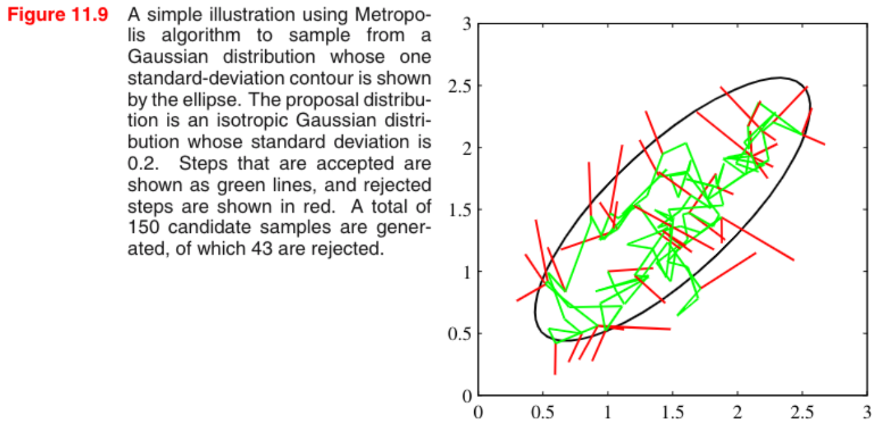
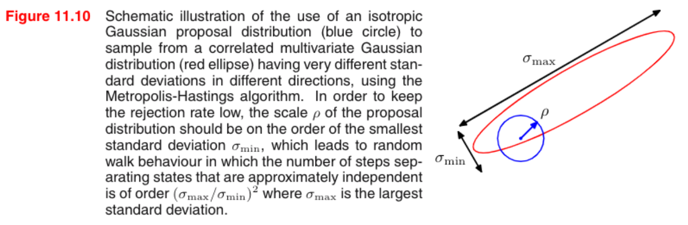
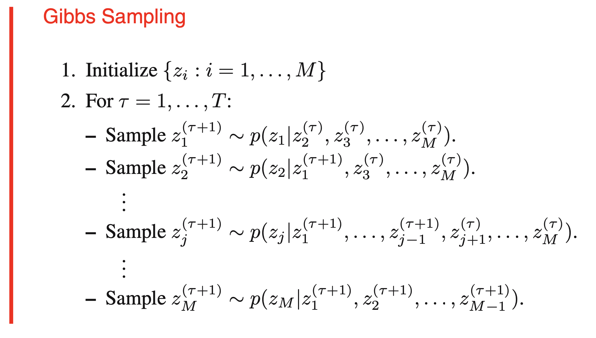
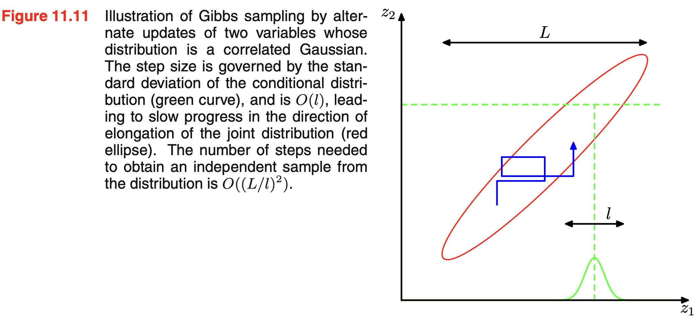
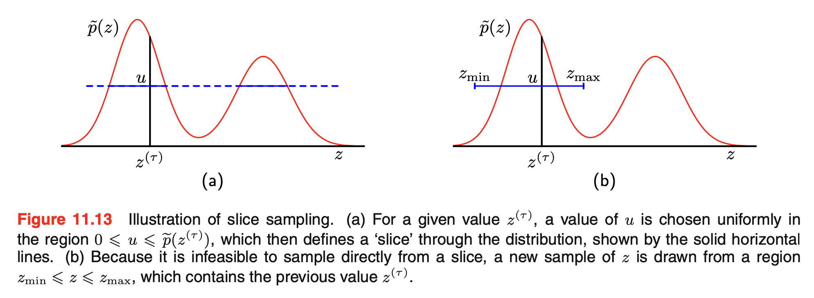

<!--
_class: lead
_paginate: false
-->

# PRML 11.2 - 11.4

2022/09/13 &emsp; esonomot

---

### 11.2 Markov Chain Monte Carlo

- これまで見た棄却サンプリングなどは、高次元になると sampling 効率が指数関数的に悪くなっていくという「次元の呪い」が存在していた
- そこで次元に依らない別の sampling 手法として、最終的に得られる数 (列) が欲しい分布 $p(z)$ に従うよう、適当な値 $\bm{z}$ から始める何らかの連続的な sampling を考える
- この手法が満たして欲しい性質は以下の 2 つである
    1. 欲しい分布 $p(\bm{z})$ を不変に保つ sampling が存在する
    2. どんな分布から始めても sampling が最終的に欲しい分布 $p(\bm{z})$ に収束する
- **Markov chain** を使うとこの 2 つの要請を満たす条件を簡単に導くことができる

> ここでも $p(z) = \tilde{p}(z)/Z_p$ としたとき $\tilde{p}(z)$ はすぐに計算できるとする

---

### 11.2.1 Markov Chains

- **A first-order Markov chain** is a series of random variables $\bm{z}^{(1)}, \cdots, \bm{z}^{(M)}$ following the conditional independence property 
    $$
    p(\bm{z}^{(m+1)}| \bm{z}^{(1)}, \cdots, \bm{z}^{(m)}) = p(\bm{z}^{(m+1)}| \bm{z}^{(m)}),
    $$
    for $m \in \{1,\cdots, M-1\}$.
- 従って、以下の 2 つがわかれば Markov chain を指定することができる
    - 初期値 $p(\bm{z}^{(0)})$ 
    - **遷移確率** (trainsition probability) &nbsp; $T_m(\bm{z}^{(m+1)}, \bm{z}^{(m)}) \equiv p(\bm{z}^{(m+1)} | \bm{z}^{(m)})$
- 全ての $m$ について遷移確率の同じ Markov chain は**均一マルコフ連鎖** (homogeneous Markov chain) と呼ばれる

---

### Invariance of Distributions

- Markov chain では、特定の変数の周辺分布はその一つ前の変数のみで表される
    $$
    p(\bm{z}^{(m+1)}) = \sum_{\bm{z}^{(m)}} p (\bm{z}^{(m+1)} | \bm{z}^{(m)}) p(\bm{z}^{(m)}).
    $$
- 分布が Markov 連鎖の前後で変わらないとき、その分布は Markov 連鎖に関して**不変** (もしくは定常) と呼ばれる
- 例えば、遷移確率が $T(\bm{z}', \bm{z})$ である均一マルコフ連鎖において、
    $$
    p^*(\bm{z}) = \sum_{\bm{z}'} T(\bm{z}',\bm{z}) p^*(\bm{z}'),
    $$
    が成り立つとき、分布 $p^*(\bm{z})$ は不変である
---

### Detailed Balance

- 1 つ目の要請である「不変分布の存在」を保証するのが**詳細釣り合い条件**である
- 求めたい分布が不変分布であることを保証する十分条件は、分布 $p^*(\bm{z})$ に対し
    $$
    p^*(\bm{z}) T(\bm{z}, \bm{z}') = p^*(\bm{z}') T(\bm{z}', \bm{z}),
    $$
    で定義される**詳細釣り合い条件** (detailed balance) が満たされるように遷移確率を選ぶことである
- 詳細釣り合い条件を満たすならばその分布が不変であることは容易に導かれる
    $$
    \sum_{\bm{z}'} p^*(\bm{z}') T(\bm{z}', \bm{z})
    = p^*(\bm{z}) \sum_{\bm{z}'} T(\bm{z}, \bm{z}')
    = p^*(\bm{z}).
    $$

---

### Ergodicity

- 2 つ目の要請である「分布の収束性」を保証するのが**エルゴード性**である
- Markov chain におけるエルゴード性とは Markov chain が既約かつ非周期的であることである
    - 既約：Markov chain がこれ以上小さい Markov chain に分割できない
    - 非周期的：Markov chain に循環がない
- エルゴード性を持つマルコフ連鎖 (エルゴード的マルコフ連鎖) における不変分布は**平衡分布**と呼ばれ、平衡分布はただ 1 つだけ存在することが知られている

---

### Summary

- 任意の Markov chain が少なくとも一つの不変分布を持つことから
    - 求めたい分布が詳細釣り合い条件を満たすならば求めたい分布は不変分布である
    - エルゴード的 Markov chain は任意の初期分布に対して不変分布に収束する

    という性質が導かれる
- 結果として、**求めたい分布に関して詳細釣り合い条件を満たすようにエルゴード的 Markov chain を構成すれば、求めたい分布に収束するような数 (列) が得られる**ということがわかった

---

### 11.2.2 The Metropolis-Hastings algorithm

- 上記条件を満たす最も一般的な方法が Metropolis-Hastings アルゴリズムである
- **The Metropolis-Hastings algorithm**
At step $\tau$ of the algorithm, in which the current state is $z(\tau)$, we draw a sample $\bm{z}^*$ from the distribution $q_k(\bm{z}| \bm{z}^{(\tau)})$ and then accept it with probability
    $$
    A_k(\bm{z}^*, \bm{z}^{(\tau)})
    = \min \left(
        1,
        \frac{\tilde{p}(\bm{z^*}) q_k(\bm{z}^{(\tau)}| \bm{z}^*)}{\tilde{p}(\bm{z^{(\tau)}}) q_k(\bm{z}^*| \bm{z}^{(\tau)})}
    \right),
    $$
    where $k$ labels the members of the set of possible transitions being considered.
- 対称な提案分布の場合、$q_k$ が分母分子でキャンセルされ $\tilde{p}$ の大小のみで棄却が決まる **Metropolis algorithm** となる

---

## Metropolis Algorighm

---

### Detailed Balance

- Metropolis-Hasting algorithm では、棄却条件は
    $$
    \begin{aligned}
    p(\bm{z}) q_k(\bm{z}'| \bm{z}) A_k(\bm{z}', \bm{z})
    &= \min (
        p(\bm{z}) q_k(\bm{z}'| \bm{z}),
        p(\bm{z}') q_k(\bm{z}| \bm{z}')
    ), \\
    &= \min (
        p(\bm{z}') q_k(\bm{z}| \bm{z}'),
        p(\bm{z}) q_k(\bm{z}'| \bm{z})
    ), \\
    &= p(\bm{z}') q_k(\bm{z}| \bm{z}') A_k(\bm{z}, \bm{z}').
    \end{aligned}
    $$
    と表されるので、詳細釣り合い条件が満たされていることがわかる

---

### Choice of Proposal Distribution

- 提案分布の選択はアルゴリズムの性能に大きな影響を与える
    - 小さな分散 → 棄却率は低いが状態空間内の進みは遅い
    - 大きな分散 → 棄却率は高いが状態空間内の進みは早い
- $z$ の要素間に強い相関を持つ多変量 (2変量) 分布 $p(\bm{z})$ を考える (Figure 11.10)
- このとき、
    - 高い棄却率を招かない最大の分散 $\rho$ のスケールは $\sigma_{\rm min}$
    - 分散が大きな方向に沿ってランダムウォーク的に探索することから、独立なサンプルは $(\sigma_{\rm max}/\sigma_{\rm min})^2$ 程度のステップで得られる

---

### Illustration of Exploration

---

### Choice of Proposal Distribution in General

- 実は 2 次元の場合、棄却率の高さと探索範囲の広さが相殺されるため、$\rho$ を $\sigma_{\rm max}, \sigma_{\rm min}$ のどちらに設定しても探索効率は変わらない
- そのため、より一般に、多変量ガウス分布では 2 番目に小さな標準偏差 $\sigma_2$ を用いて探索するのが効率がよく、その結果独立なサンプルを得られるステップはおよそ $(\sigma_{\rm max}/\sigma_2)^2$ となる

---

### 11.3 Gibbs Sampling

- Gibbs sampling は先の Metropolis-Hastings algorithm の特別な場合に相当する

---

### Check of Gibbs Sampling

- Gibbs Sampling が欲しい分布のサンプリングを与えることを簡単にチェック
- $p(\bm{z})$ が不変分布であること (← 詳細釣り合い)
    - サンプリングで $\bm{z}_{\backslash i}$ の値は変更されないので周辺分布 $p(\bm{z}_{\backslash i})$ は不変
    - 定義より各ステップは $p(z_i| \bm{z}_{\backslash i})$ からサンプリングを行うので、合わせて $p(\bm{z})$ は不変である
- エルゴード性
    - エルゴード性の十分条件は条件付き分布の確率が 0 となる場合がないこと
    (これが成り立てば $\bm{z}$ 空間上の任意の点から別の任意の点へ有限回のステップで移動できる)
    - これが成り立たない場合、エルゴード性は明示的に証明される必要がある

---

### Relation to the Metropolis-Hastings Algorithm

- Metropolis-Hastings algorithm で、$\bm{z}$ から $\bm{z}^*$ への遷移を以下のようにする
    $$
    q_k(\bm{z}^*| \bm{z}) = p(z_k^*| \bm{z}_{\backslash k}).
    $$
- このとき、$p(\bm{z}) = p(z_k| \bm{z}_{\backslash k}) p(\bm{z}_{\backslash k})$ と $\bm{z}^*_{\backslash k} = \bm{z}_{\backslash k}$ より
    $$
    \begin{aligned}
        A(\bm{z}^*, \bm{z})
        &= \frac{p(\bm{z^*}) q_k(\bm{z}| \bm{z}^*)}{p(\bm{z}) q_k(\bm{z}^*| \bm{z})} \\
        &= \frac{
                p(z_k^*| \bm{z^*}_{\backslash k})p(\bm{z}^*_{\backslash k}) p(z_k| \bm{z}^*_{\backslash k})
            }{
                p(z_k| \bm{z}_{\backslash k})p(\bm{z}_{\backslash k}) p(z_k^*| \bm{z}_{\backslash k})
            }
        = 1.
    \end{aligned}
    $$
    となり、Metropolis-Hastings algorithm はサンプルを常に受理することがわかる

---

### Illustration of Gibbs Sampling

- 条件付き分布の幅を $l$ とすれば、独立なサンプルを得るためのステップはおよそ $(L/l)^2$ になる

---

### Over-Relaxation

- Gibbs sampling におけるランダムウォーク的な振る舞いを提言するアプローチの一つが**過剰緩和** (over-relaxatioin) である
- 条件付き分布がガウス分布である場合を考えると、ギブスサンプリングの各ステップで要素 $z_i$ の条件付き分布はある平均 $\mu_i$ と分散 $\sigma_i^2$ を持つ
- それを平均 $0$、分散 $1$ のガウス分布に従う確率変数 $\nu$ と $-1 < \alpha < 1$ を用いて
    $$
    z_i' = \mu_i + \alpha(z_i - \mu_i) + \sigma_i(1 - \alpha^2)^{1/2} \nu,
    $$
    と置き換えることで、ステップの平均方向にバイアスをかける
- こうすることで、(変数が高い相関を持つとき) 状態空間内の方向付けられた移動を促進することができる

> over-relaxation は元々条件付き分布がガウス分布である場合に用いる手法として提案された

---

### Gibbs Sampling の実用性

- ギブスサンプリングが適応可能か否かは条件付き分布からのサンプリングが容易にできるかどうかに依る
- ギブスサンプリングにあたって考慮するべき変数はマルコフブランケットで表される
    - マルコフブランケットで条件付けられた分布は対数凹関数になりがちらしいので、適応棄却サンプリングできる
    - グラフが指数分布族で表され共役性があるなら関数形が容易にわかるので標準的なサンプリング手法を使える
- 数列の相関を下げるため、1 つの変数だけでなく複数の変数をまとめて更新する**ブロック化ギブスサンプリング**アルゴリズムというものもある

---

### 11.4 Slice Sampling

- 分布の特徴にあわせた適応的なステップサイズの選び方
- 1 変数の場合、$z$ を付加的な変数 $u$ で拡張し、以下の確率分布
    $$
    \hat{p}(z, u) = 
    \begin{cases}
        1/Z_p & (0 \leq u \leq \tilde{p}(z)) \\
        0     & ({\rm otherwise})
    \end{cases}
    $$
    から一様にサンプリングして $u$ を無視することで $p(z)$ からサンプリングできる
- 具体的には、適当な $z$ を初期値として以下を繰り返す
    1. $\tilde{p}(z)$ を求め一様に $u$ をサンプリングする
    2. $u$ を固定し、$\{z: \tilde{p}(z) > u\}$ から $z$ を一様にサンプリングする

> こうすると分布全体から広くサンプリングできるため、Metropolice-Hastings などより効率が良い
---

### Illustration of Slice Sampling

- 実際のように分布のスライスから直接サンプリングすることが難しい場合、代わりに $\hat{p}(z, u)$ を不変にするサンプリングスキームを定義し、$z^{(\tau)}$ を含む適当な区間から $z^{(\tau+1)}$ を決定する

