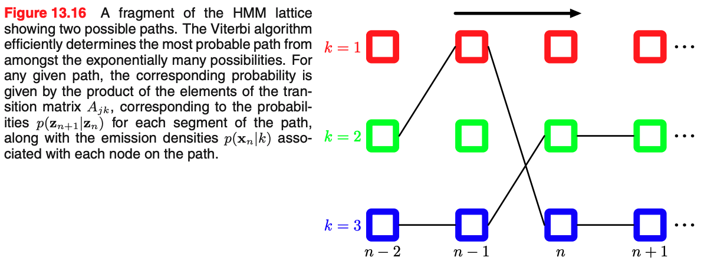

<!--
_class: lead
_paginate: false
-->

# PRML 13.2.2 - 13.2.6

2022/11/01 &emsp; esonomot

---

### 13.2.2 The forward-backward algorithm

- ここまでのまとめ
    - HMM のパラメータの最尤推定を行いたい
    - ただし尤度関数 $p(\bm{X} | \bm{\theta}) = \sum_{\bm{Z}} p(\bm{X}, \bm{Z} | \bm{\theta})$ は一般に閉じた解を持たない
    - EM アルゴリズムを使って最尤推定を行おう！
- この章では EM アルゴリズムにおける期待値の計算手法 (E step) を説明する
    - 2 段階のメッセージパッシングアルゴリズムにより効率よく計算可能
    - HMM の文脈では **forward-backward/Baum-Welch algorithm** と呼ばれる
    - その中でも最もよく使われる $\alpha - \beta$ algorithm に焦点を当てる

> 13.2.3 で forward-backward algorithm が積和アルゴリズムの一例であることを見る

---

### 13.2.2 The forward-backward algorithm

- 以下、E step ではモデルパラメータ $\bm{\theta}^{\rm old}$ は一定のため $\bm{\theta}$ 依存性は省略する
- HMM における条件付き独立性を用いて計算を進める ($\bm{X} = \{ \mathbf{x}_1, \cdots, \mathbf{x}_N\}$)

---

### Overview of EM algorithm

- 13.2.1 において、EM altorithm で最大化すべき以下の式を導いた
    $$
    \begin{aligned}
        Q(\bm{\theta}, \bm{\theta}^{\rm old})
        &= \sum^K_{k=1} \gamma(z_{1k}) \ln \pi_k 
        + \sum^N_{n=2} \sum^K_{j=1} \sum^{K}_{k=1} \xi(z_{n-1,j}, z_{nk}) \ln A_{jk} \\
        &+ \sum^N_{n=1} \sum^K_{k=1} \gamma(z_{nk}) \ln p(\mathbf{x}_n | \bm{\phi}_k)
    \end{aligned}
    $$
    where
    $$
    \begin{aligned}
        \gamma(\bm{z}_n) &= p(\mathbf{z}_n | \bm{X}, \bm{\theta}^{\rm old}), \\
        \xi(\mathbf{z}_{n-1}, \mathbf{z}_n) &= p(\mathbf{z}_{n-1}, \mathbf{z}_n | \bm{X}, \bm{\theta}^{\rm old}).
    \end{aligned}
    $$
- ここでは $\gamma$, $\xi$ の具体的な計算を forward-backward algorithm を用いて行う

---

### Calculation of $\gamma(\mathbf{z}_n)$

- Bayes の定理より、
    $$
    \begin{aligned}
        \gamma(\mathbf{z}_n)
        &= p(\mathbf{z}_n | \mathbf{X})
        = \frac{p(\mathbf{X}|\mathbf{z}_n) p(\mathbf{z}_n)}{p(\mathbf{X})}, \\
        &= \frac{p(\mathbf{x}_1, \cdots, \mathbf{x}_n, \mathbf{z}_n) p(\bm{x}_{n+1}, \cdots, \bm{x}_N| \bm{z}_n)}{p(\mathbf{X})}, \\
        &\equiv \frac{\alpha(\mathbf{z}_n) \beta(\mathbf{z}_n)}{p(\mathbf{X})}.
    \end{aligned}
    $$
    where
    $$
    \begin{aligned}
        \alpha(\mathbf{z}_n) &\equiv p(\mathbf{x}_1, \cdots, \mathbf{x}_n, \mathbf{z}_n), \\
        \beta(\mathbf{z}_n) &\equiv p(\mathbf{x}_1, \cdots, \mathbf{x}_n| \mathbf{z}_n).
    \end{aligned}
    $$

---

### Calculation of $\alpha(z_n)$

- (13.25), (13.26) を用いて式変形すると $\alpha(\mathbf{z}_n)$ は $\alpha(\mathbf{z}_{n-1})$ のみを用いて表せる

$$
\therefore \quad
\alpha(\mathbf{z}_n)
= p(\mathbf{x}_n | \mathbf{z}_n) \sum_{\mathbf{z}_{n-1}} \alpha(\mathbf{z}_{n-1}) p(\mathbf{z}_n | \mathbf{z}_{n-1}).
$$

---

### Calculation of $\alpha(z_n)$

- $\alpha(\mathbf{z}_n)$ の計算量は、 $\mathbf{z}_{n-1}$ と $\mathbf{z}_n$ のそれぞれについて計算するので $\mathcal{O}(K^2)$
- 全計算量は $\alpha(\mathbf{z}_n)$ を $N$ 回計算するので $\mathcal{O}(K^2N)$

---

### Calculation of $\beta(z_n)$

- (13.27), (13.28) を用いて式変形すると $\beta(\mathbf{z}_n)$ は $\beta(\mathbf{z}_{n+1})$ のみを用いて表せる

$$
\therefore \quad
\beta(\mathbf{z}_n)
= \sum_{\mathbf{z}_{n+1}} \beta(\mathbf{z}_{n+1}) p(\mathbf{x}_{n+1} | \mathbf{z}_{n+1}) p(\mathbf{z}_{n+1} | \mathbf{z}_n).
$$

---

### Calculation of $\beta(z_n)$

- $n=N$ について (13.33) を考えると $\beta(\mathbf{z}_N) = 1$ が初期値となる

---

### Calculation of $p(\mathbf{X})$

- EM アルゴリズムでは顕に計算されないが、尤度関数 $p(\mathbf{X})$ は最適化中に watch しておきたい値のため計算しておく
- (13.33) を $\mathbf{z}_n$ に関して和を取れば
    $$
    \begin{aligned}
        p(\mathbf{X})
        = \sum_{\mathbf{z}_n} \alpha(\mathbf{z}_n) \beta(\mathbf{z}_n)
    \end{aligned}
    $$
    となるため、$\alpha$ と $\beta$ がそれぞれ先の方法で計算できれば簡単に尤度関数の値も求めることができる
- 単純に最後 ($n=N$) の尤度だけを計算したい場合、$\beta(\mathbf{z}_N) = 1$ なので $\alpha$ のみ順に計算すれば良い

---

### Calculation of $\xi(\mathbf{z}_{n-1}, \mathbf{z}_n)$

- 定義と Bayes の定理より

- 従って、こちらも $\alpha$ と $\beta$ が求まれば計算できる

---

### Summary of EM algorithm in HMM

1. パラメータの初期値 $\bm{\theta}^{\rm old}$ の決定
    - $\bf{A}$ や $\pi$ は一様分布から生成されることが多い
    - $\bf{\phi}$ は分布によるが、例えばガウス分布などから生成する
2. フォワード $\alpha$ 回帰とバックワード $\beta$ 回帰を実行して $\gamma, \xi$ を求める (E step)
3. 13.2.1 に則り M step を実行してするパラメータを更新する
4. 収束基準が満たされるまで 2, 3 を繰り返し実行する

---

### Calculation of $p(\mathbf{x}_{N+1} | \mathbf{X})$

- 最後に、データ $\mathbf{X} = \{ \mathbf{x}_1, \cdots, \mathbf{x}_N \}$ が与えられた時の予測確率を求める
- 条件付き独立性 (13.30), (13.31) より

- $\alpha(\mathbf{z}_N)$ だけ計算しておけば過去の値を保持することなく予測確率が計算できる

---

### 13.2.3 The sum-product algorithm for the HMM

- 8.4.4 でみた積和アルゴリズムを用いると $\alpha-\beta$ 再帰式と同様の結果が導かれることを確認する
- HMM の有効グラフ図 13.5 を因子グラフ化すると以下のよう

---

### 13.2.3 The sum-product algorithm for the HMM

- ただし、予測確率を導出するためには $\mathbf{x}_1, \cdots, \mathbf{x}_N$ の条件付き分布にする必要があるので、以下のように因子グラフを単純化する
    $$
    \begin{aligned}
    h(\mathbf{z}_1) &= p(\mathbf{z}_1) p(\mathbf{x}_1 | \mathbf{z}_1), \\
    f_n(\mathbf{z}_{n-1}, \mathbf{z}_n) &= p(\mathbf{z}_n | \mathbf{z}_{n-1}) p(\mathbf{x}_n | \mathbf{z}_n).
    \end{aligned}
    $$

---

### Forward propergation

- $\mathbf{z}_N$ を根ノード、$h$ を葉ノードとしてまずは葉ノードから根ノードへのメッセージの伝搬を考える
- (8.66), (8.69) より、

- (13.47) を用いて (13.48) から $\mu_{\mathbf{z}_{n-1} \rightarrow f_n}(\mathbf{z}_n)$ を消去すると、
    $$
        \mu_{f_n \rightarrow \mathbf{z}_n}(\mathbf{z}_n)
        = \sum_{\mathbf{z}_{n-1}} f_n(\mathbf{z}_{n-1}, \mathbf{z}_n) \mu_{f_{n-1} \rightarrow \mathbf{z}_{n-1}}(\mathbf{z}_{n-1}),
    $$
    なので、$\alpha(\mathbf{z}_n) = \mu_{f_n \rightarrow \mathbf{z}_n} (\mathbf{z}_n)$ とすれば定義より求める再帰式と同じである

---

### Backward propergation

- 次に根ノードから葉ノードへの伝搬について、葉ノードでは何の計算も行われないことに注意して、同様に $\mathbf{z} \rightarrow f$ タイプのメッセージを削除すると、
    $$
        \mu_{f_{n+1} \rightarrow \mathbf{z}_n}(\mathbf{z}_n)
        = \sum_{\mathbf{z}_{n+1}} f_{n+1}(\mathbf{z}_n, \mathbf{z}_{n+1}) \mu_{f_{n+2} \rightarrow \mathbf{z}_{n+1}}(\mathbf{z}_{n+1}).
    $$
- $\beta(\mathbf{z}_n) = \mu_{f_{n+1} \rightarrow \mathbf{z}_n} (\mathbf{z}_n)$ とすれば定義より $\beta$ の再帰式を得る
- ノード $\mathbf{z_n}$ における局所的な同時確率は (8.63) より入ってくるメッセージの積で表され、
    $$
        p(\mathbf{z}_n, \mathbf{X})
        =  \mu_{f_n \rightarrow \mathbf{z}_n}(\mathbf{z}_n) \mu_{f_{n+1} \rightarrow \mathbf{z}_n}
        = \alpha(\mathbf{z}_n) \beta(\mathbf{z}_n).
    $$

---

### 13.2.4 Scaling factors

- forward-backward algorithm において、$\alpha(\mathbf{z}_n)$ などは確率を何度も掛けて計算されるため指数関数的に小さくなり計算機での計算が難しいという問題がある
- いつもの i.i.d. の最尤推定では log を取ることでこの問題を回避している
- そこで $\alpha, \beta$ を $\mathcal{O}(1)$ 程度に適切に rescale し計算機で計算できるようにする
- scaling factor は EM algorithm ではキャンセルされるように選ぶ

---

### Rescaling of $\alpha(\mathbf{z}_n)$

- $\alpha$ を以下のように scaling すると $K$ 個の変数についての確率分布になるためそこまで小さい値にならない
    $$
    \begin{aligned}
    \widehat{\alpha}(\mathbf{z}_n)
    &= p(\mathbf{z}_n | \mathbf{x}_1, \cdots, \mathbf{x}_n)
    = \frac{\alpha(\mathbf{z}_n)}{p(\mathbf{x}_1, \cdots, \mathbf{x}_n)}. \\
    \end{aligned}
    $$
- $c_n \equiv p(\mathbf{x}_n | \mathbf{x}_1, \cdots, \mathbf{x}_{n-1})$ とすれば $p(\mathbf{x}_1, \cdots, \mathbf{x}_n) = \prod_{m=1}^{n} c_m$ より
    $$
    \begin{aligned}
        \alpha(\mathbf{z}_n)
        &= \left( \prod_{m=1}^n c_m \right) \widehat{\alpha}(\mathbf{z}_n). \\
        \therefore \quad
        c_n \widehat{\alpha}(\mathbf{z}_n)
        &= p(\mathbf{x}_n | \mathbf{z}_n) \sum_{\mathbf{z}_{n-1}} \widehat{\alpha}(\mathbf{z}_{n-1})p(\mathbf{z}_n | \mathbf{z}_{n-1}).
    \end{aligned}
    $$

---

### Rescaling of $\beta(\mathbf{z}_n)$

- 同様にして $\beta$ を以下のように rescaling する
    $$
    \begin{aligned}
        \widehat{\beta}(\mathbf{z}_n)
        = \frac{\beta(\mathbf{z}_n)}{p(\mathbf{x}_{n+1}, \cdots, \mathbf{x}_N | \mathbf{x}_1, \cdots, \mathbf{x}_n)}. \\
    \end{aligned}
    $$
- 従って、
    $$
    \begin{aligned}
        \beta(\mathbf{z}_n)
        &= \left( \prod_{m=n+1}^N c_m \right) \widehat{\beta}(\mathbf{z}_n). \\
        \therefore \quad
        c_{n+1} \widehat{\beta}(\mathbf{z}_n)
        &= \sum_{\mathbf{z}_{n+1}} \widehat{\beta}(\mathbf{z}_{n+1}) p(\mathbf{x}_{n+1} | \mathbf{z}_{n+1}) p(\mathbf{z}_{n+1} | \mathbf{z}_n).
    \end{aligned}
    $$

---

### Other variables

- From (13.33), (13.43), (13.63), likelihood and other variables are
    $$
    \begin{aligned}
        p(\mathbf{X}) &= \prod_{n=1}^N c_n, \\
        \gamma(\mathbf{z})
        &= \frac{\alpha(\mathbb{z}_n) \beta(\mathbb{z}_n)}{p(\mathbf{X})} = \widehat{\alpha}(\mathbf{z}_n) \widehat{\beta}(\mathbf{z}_n), \\
        \xi(\mathbf{z}_{n-1}, \mathbf{z}_n) &= c_n \widehat{\alpha}(\mathbf{z}_{n-1}) p(\mathbf{x}_n| \mathbf{z}_n) p(\mathbb{z}_n | \mathbb{z}_{n-1}) \widehat{\beta}(\mathbf{z}_n), \\
    \end{aligned}
    $$
- forward-backward algorithm の代替手法について (Jordan, 2007)
    - $\gamma(\mathbf{z}_n)$ を用いて backword propergation を行う $\alpha-\gamma$ 再帰がある
    - $\gamma$ の計算には $\alpha$ 必要だが $\alpha, \beta$ は独立に計算できるため、$\alpha-\beta$ 再帰が用いられることが多い

---

### 13.2.5 The Viterbi algorithm

- forward-backward algorithm で周辺確率を求めた後、**どうやって最も確からしい系列を求めますか**というお話
- 一般に、得られた観測系列に対し最も確からしい隠れ状態の系列を求めたいが、潜在状態の最も確からしい系列を求めることは個々の潜在変数に対して最も確からしい状態の集合を集めることではない (8.4.5)
    - forward-backward algorithm で $\gamma(\mathbf{z}_n)$ を求め、その中から独立に最大のものを選んだとしても一般に最も確からしい状態系列には対応しない
    - 例えば、連続する２つの状態がそれぞれ独立には最も確からしいが、その間の遷移行列が 0 なら確率 0 を持つ系列になってしまう (それぞれ単独ではめっちゃ起こりやすいが実際にそれらが連続して起こることはないみたいな感じ)
- HMM の文脈では最も確からしい系列を求めるアルゴリズムとして Viterbi algorithm がある

---

### 13.2.5 The Viterbi algorithm

- Viterbi algorithm は指数関数的に増加していく系列の空間を効率的に探索する手法を与える
- max-sum アルゴリズムを用いるため、以下のように展開

---

### 13.2.5 The Viterbi algorithm

- (8.93), (8.94) より

- $\mu_{\mathbf{z}_n \rightarrow f_{n+1}}(\mathbf{z}_n)$ を消去して (13.46) を用いれば
    $$
    \omega (\mathbf{z}_{n+1})
    = \ln p(\mathbf{x}_{n+1} | \mathbf{z}_{n+1}) + \max \{\ln p(\mathbf{x}_{+1}|\mathbf{z}_n) + \omega(\mathbf{z}_n)\}.
    $$
    where $\omega(\mathbf{z}_n) \equiv \mu_{\mathbf{z}_n \rightarrow f_{n+1}}(\mathbf{z}_n)$
- 初期値は (8.95) と (8.96) から
    $$
    \omega (\mathbf{z}_{n})
    = \ln p(\mathbf{z}_{1}) + \ln p(\mathbf{x}_{1}|\mathbf{z}_1).
    $$

---

### 13.2.5 The Viterbi algorithm

- (13.6) を愚直に計算すると (13.68) と同じ式になることがわかり (演習 13.16)、
    $$
    \omega (\mathbf{z}_{n})
    = \max_{\mathbf{z}_1, \cdots, \mathbf{z}_{n-1}} \ln p(\mathbf{x}_{1}, \cdots, \mathbf{x}_n, \mathbf{z}_{1}, \cdots, \mathbf{z}_n).
    $$
- 従って、$\omega$ を計算すれば最も確からしい経路に対応する同時分布が得られる
- 直感的には以下のように理解できる
    1. ある時刻 $n$ に状態 $k$ となる最大の確率を持つ経路のみを保存する
    2. 次のステップ $n+1$ に遷移する確率を $K^2$ 通り計算する
    3. そのうち最大の確率を与える経路のみを保持する
    4. 最後までいったらその最大値を与える経路を逆向きに特定していく

---

### 13.2.6 Extensions of the hidden Markov model

- HMM の応用例についての議論
    - HMM はデータの生成モデルとしては極めて貧弱
    - 一方で系列の分類には最尤推定より良い手法
- $R$ 個の観測系列 $\mathbf{X}_r (r=1, \cdots, R)$ にそれぞれクラス $m (m=1, \cdots, M)$ のラベルが付けられている時、各々のクラスに対しパラメータ $\mathbf{\theta}_m$ を持つ HMM を定義すると、交差エントロピーは
    $$
        \sum_{r=1}^R \ln p(m_r| \mathbf{X}_r)
        = \sum_{r=1}^R \ln \left\{ \frac{p(\mathbf{X}_r| \mathbf{\theta}_r) p(m_r)}{\sum_{l=1}^M p(\mathbf{X}_r| \mathbf{\theta}_l) p(l_r)} \right\}.
    $$
- この最大化には色々な手法があり、識別学習と結びついた HMM は音声認識でよく使われる

---

### Problems of HMM

1. 系が与えられた状態に留まることを表現するのが難しい
    - ちょうど $T$ ステップだけ状態 $k$ にいてから違う状態に遷移する確率は
        $$
            p(T) = (A_{kk})^T (1-A_{kk}) \propto \exp (T \ln A_{kk}).
        $$
        となり、指数関数的に減衰してしまう
    - $A_{kk} = 0$ として状態 $k$ におけるあり得る継続時間のモデル $p(T|k)$ を明示的に定義することでこの問題を解消する
2. 観測変数間の長い範囲の相関を反映させづらい
    - 隠れ状態の一次マルコフ連鎖では長い相関は伝えづらい
    - 解決策として**自己回帰マルコフモデル** (autoregressive hidden Markov model) がある

---

### Autoregressive HMM

- やりたいことに応じてグラフにリンクを付け足す
- 下の図は各々の観測変数が二つ前の観測変数に依存している例
- 条件付き独立性 (13.5) $\mathbf{z}_n \perp \mathbf{z}_{n-1} | \mathbf{z}_n$ は依然成り立つ

---

### Input-output HMM

- 出力変数 $\mathbf{x}_1, \cdots, \mathbf{x}_N$ に加えて観測変数系列 $\mathbf{u}, \cdots, \mathbf{u}_N$ があり、それらが観測変数・潜在変数のどちらか or 両方に影響を与える
- 潜在変数の連鎖に関するマルコフ性 (13.5) はこちらも成り立つ

---

### Factorial HMM (階乗隠れマルコフモデル)

- 互いに独立な複数の潜在変数のマルコフ連鎖があり、与えられた時刻での観測変数の分布が同時刻における全ての潜在変数の状態に依存する
- しかし、潜在変数同士が head-to-head となり独立でなくなるため E step で forward-backward algorithm をできず、計算が煩雑になる

